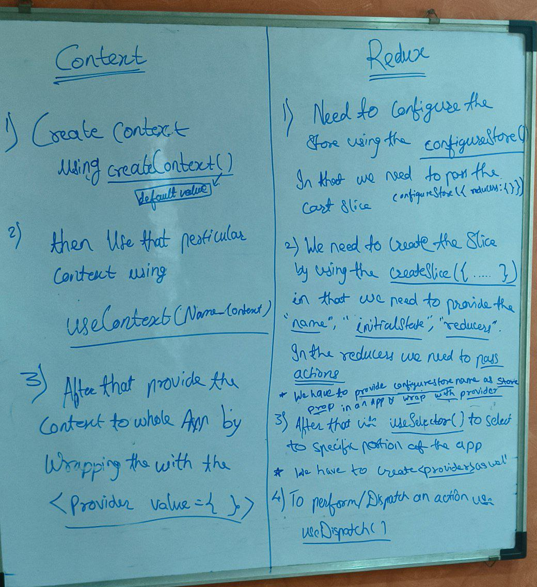

| S.No | Topic   | Tags                                               |      Link       |
| :--: | :------------------------- | :------------------------------------------------- | :-------------------------------------------------: |
|  1.  | Inception                  | `react` `react-dom` `react element`                |                 [ 🔗](1.Inception)                  |
|  2.  | Igniting Our App           | `bundler` `parcel`                                 |            [ 🔗](2.Ignition%20our%20App)            |
|  3.  | Laying the foundation      | `jsx` `babel` `components`                         |         [ 🔗](3.Laying%20the%20Foundation)          |
|  4.  | Coding in React            | `Reconciliation` `Virtual DOM` `config driven UI`  | [ 🔗](4.Talk%20is%20Cheak%20show%20me%20the%20code) |
|  5.  | Let's get hooked           | `useState` `data binding` `name & default export`  |            [ 🔗](5.Lets%20Get%20Hooked)             |
|  6.  | Exploring the world        | `useEffect` `conditional rendereing` `shimmer`     |          [ 🔗](6.Exploring%20the%20world)           |
|  7.  | Finding the path           | `Routing` `create-router-dom` `Formik`             |             [ 🔗](07-finding-the-path)              |
|  8.  | Let's get Classy           | `class components`                                 |            [ 🔗](8.Lets%20Get%20Classy)             |
|  9.  | Optimizing our App         | `custom hooks` `lazy loading`                      |           [ 🔗](9.Optimizing%20our%20app)           |
| 10.  | Jo Dikhta Hai Vo Bikta Hai | `UI Layer & Data Layer` `PROPS DRILLING` `Context` |   [ 🔗](10.Jo%20DIkhta%20Hai%20Vo%20Bikta%20hai/)   |
| 11.  | Lets Build our Store       | `Redux Toolkit` `Redux Architecture`               |        [ 🔗](11.Lets%20Build%20our%20Store/)        |
| 12.  | Time for the test          | `JEST`                                             |         [ 🔗](12.Time%20for%20the%20test/)          |
| 13.  | Machine Coding Interview   | `Whole Coverup In Project`                         |       [ 🔗](13.Machine%20Coding%20Interview/)       |
| 14.  | Building Advanced Youtube  | `Debouncing` `Higher Order Component`              |     [ 🔗](14.%20Building%20Advance%20Youtube/)      |
| 15.  | The End Game               | `Live Chat` `API Polling` `Hooks`                  |           [ 🔗](15.%20The%20End%20Game/)            |

<div align="center"> <h1> React-Learning </h1> </div>

Cheetsheet:

1. [React](https://react-tutorial.app/app.html?id=328)
2. [Javascript](https://learnjavascript.online/?utm_source=react-tutorial.app)
3. [TailwindCSS](https://nerdcave.com/tailwind-cheat-sheet)
4. [JEST](https://jestjs.io/docs/getting-started#using-babel)

   cdn links make the project slow

npm use to manage all the package

npm init => create package.json

npm i -D parcel => it is use to install parcel as devdependencies
-D means devdependencies only in the Devlopment Environment
we can install any package without -D that means it for globle Environment
^ (caret) => Auto upgrade to existing version

as soon as any dependencies/devdependencies install then package-lock.json file
and node_module folder created

npm i react => to install the react
npm i react-dom => to install the react-dom

npx means it execute

npx parcel index.html => is to run the parcel to the entry point
as soon as hit above command then dist and .parcel-cache folder created
dist folder keep the file minify for us

npx parcel build index.html => is to run the parcel and make the project production build
and it will minifyall the dile into the dist folder

Polyfill =>is nothing but the code which is replacement for the newer version of the code
(converting the code to the older version of the browser is Called Bable)

<h2> Q: How can u build perfomant web scalable app?</h2>
A: There are so many things React optimise do it for us and so many things bundlers gives us
whole app is the combination of these 2 things.

npm i -D babel-plugin-transform-remove-console => remove the console.logs
in the dist folder which help to minify the code
.babelrc is use for babel configuration.

[Reconcilition](https://legacy.reactjs.org/docs/reconciliation.html)

render means updating something into the dom

JSX its use the html inside the js

<h2> Q: what is JSX? </h2>
A: JSX is the html like syntax but it is not html inside js

jsx use React.createElement behind the scene JSX => React.createElement => Object =>HTML(DOM)
babel understand JSX

babel is the compiler next generation js

    // React Compnent
    // Functional  it is NEW
    //  class based component it is OLD

<h2> Q: what is functional component </h2>
A: it is nothing but the function that return some piece of jsx or react element

Write name of the component start with capital letter.

JSX is very Secure

nested component is called component composition

JSX can only have one parent so to overcome that React.Fragment
came into the picture and it is like an Empty Tag
using React.Fragment is looks so ugly so instead of that write empty <> </>

<React.Fragment> < /React.Fragment> === <></>

**_ Config Driven UI _**

Virtual DOM is just not the concept of the react but the concept of the Software Engg concept and react also use it

Virtual DOM => Keeping the reperesntetion of the dom with us.

# why react is fast because it get help of state to update when whenever state varibale changes it create new object .i.e similar to React.createElement and it get diff from current and previous and that updated virtual dom then pdate the actual dom. Efficiently dom manupulation

<h2> Q:Why we need Virtual DOM? </h2>
A: It needed for Reconciliation uses diff algo =>it find diff between Trees (it will only reender the specific portion)

Key help to react that what need to be Updated

React Fiber is the new Reconciliation Engine

Every Compnent in react maintains the state and u can put all the variable into the state

What is state

<h2> Q:what is useState? </h2>
A: It is use to create a state varibales and it comes form react
useState() => it return an array and the first variable of the array is the variable name and second is the function to upadate the variable
syntax :
//local state variable in react

                const [variableName, setVariableName] =useState("Search"); //use the text in param

React says Every time u need ur varibale to be sync with UI Use useState variable.

<h2> Q:what is React hooks?</h2>
    A: it is nothing but the normal function, the are so many hooks and one of the hook we use is useState hook

In the Reconciliation process there is the Diff algo use in it >>> React Fiber is the new reconciliation algorith

rerender the component every time when useState Varibale calls

## Q: Why React is Fast ?

    A: because of the fast dom manupulation, Whenever any changes happened
        in the state then its Quickly rerender everything (everytimes).

### ----------------------------------------------------------------

Monolith >> whole project deploy uding 1 repo

<h2> Q: Microservice Advantages </h2>
    A: Diffrent projects all together,  Easy to maintain,Sepration of concern , no need to depend on some specific Lang.

### Hooks start with use

we can use hooks by simply calling them

2. @Hook >> useEffect Hook > it comes from react Lib

   us can call the function by passing another function in to it and another fuction is CALLBACK function

   use can calll the useEffect() by giving 2 params they are CALLBACK and DEPENDENCY ARRAY.
   if we pass anything into the dependency array then everytime the value is use the useEffect is call and we need tot return for cclearning up because it is SPA so if u go on another page it will stay there so better to clean up things
   we can returnin the useEffect

   ```javascript
   useEffect(() =>{

    Your code

    return () =>{
      clear code()
    }

   } ,[])
   ```

### It is the best place to make API call

by default it will be call once after components render

and if we dont pass any thing in the useEffect hook apart from the callback function it will call every time when the component renders, if we pass dependency arry then it will call only once after render

### optional Chaining >> if data not presend in the perticualr place it help to not get and error

### Shimmer effect which resembless the actual page's UI

by default the length of the page is 0

Don't create (Functional) component inside component, otherwise it will call alot of times

#### Never write your useState Inside the IF..Else or also in Forloop

#### react gives useState hook to use as local variable inside functional component

#### @Never use usestate outside of functional component

#### CDN is the optimalway to store images because it is fast

#### createBrowserRouter it comes from react-router-dom help to create routing{route to perticular page } it takes some configuration(Array){which is the list of path}

#### RouterProvider it comes from react-router-dom help to create routing

root.render rnders whatever u gave so if u want to render acccordingly then use RouterProvider
Syntax:

```js

root.render(< RouterProvider router={createBrowserRouter_const_name}>)
```

### SPA - Single Page Application

#### There are 2 types of routing

1.Client-side routing
2.Server-side routing =>it is a way that all pages comes from server

#### Links are the another component comes from react-router-dom help to create routing

#### if want to route to another page but also wanted SPA then Import Link from react-router-dom

#### and it is alternative of anchor tag, anchor tag reload the whole page while Link does SPA

#### at the end Link Compoent uses anchor tag behind the scenes

if u have to create nested route u have to create Outlets it comes from react-router-dom
help to keep changing according to the routes

#### all the children written in the createBrowserRouter goes into the outlet

#### useParams is another hook it is use to read the dinamic url parameters

### ----------------------------------------------------------------

<h2> Q: Class Based Components </h2>
 A: It is the easrlier concept it introduce before Hooks and it is very hard to wirte code in early time.
  It is kind of Depricated menthod its alternative is Functional Component

we can create classbased compoent with the help of class keyword and extends React.Component and React.component comes from react
syntax : class {className} extends React.Component
most imp part of the classbased compoent is @Render Method it help to return some JSX code just like functional component

componentDidMount is the method in the classbased component which is the best place to call the API and it will be call after first render
Constructor >> Render >> componentDidMount

componentDidUpdate it will call after every next render

componentWillUnmount use for "cleanUp"

### ----------------------------------------------------------------

### Building our Own Hooks

it is use for useablability, readablelity, easy to maintain

whenever create any hook always make new file and file name start with use

### useState Returns >> target

there is one event listner call Online which help to show the user is offline or not
and is u use any event listner u must need to clean all the event listner because if u use another listner and then back to that normal listner then the new event listner is being call so use "Unmounting"

<h2> Q: How many JS /JSX file parcel produce?</h2>
A: Only one

### One one js file created by bundle but it is bigger projects and has more than 100 components then one-bundle break ur code

so u have to splitting the code or make it in small chunks or "OnDemand Loading"

JUst like useState react also give us lazy which is help for lazy loading it take a function and useful for dynamic import or lazy import
and it is use to create another bundler which help for code chunking
Syntax:
const VARNAME = lazy( ( ) => import("Relative Path") )

react will try to render the things which is not in there so it gives an error so it will suspend the operation

### When u r loading the component on demand react try to sunspend it

Upon OnDemand LOading -> Upon Render -> Suspend Loading
So to avoid the error it uses another component call suspense component and put another component in between
and if the component take long time to load into the app then suspense use props called fallback
Syntax :

```js

< Suspense fallback={< Shimmer />}> < Instamart /> < Suspense/>
```

#### Never Ever Dynamically load ur component into the the Another Component

### ----------------------------------------------------------------

<div align="center"> <h2> Jo Dikhta hai Vo Bikta hai </h2> </div>

### Q: Why we Use Frameworks

A: 1. to Write optimized css, 2. it saves time

[Tailwind Cheatsheet](https://nerdcave.com/tailwind-cheat-sheet)

- Why frameworks?

  - optimized css,
  - consistent UI
  - saves time.
  - Eg : MaterialUI, Bootstrap, Base Web UI, Ant design, chakra UI

- Can we use more than one framework ?

  - It's all package can use any number of frameworks,
  - But, not consistent way

- Different ways to write css :

  1. **Normal Native CSS** - all components's styles in a single file index.css
  2. **SCSS** - Syntactical CSS - atlast it is converted to css
  3. **Inline CSS** - style attribute - pass object - {{backgroundColor : "red"}}
  4. **Component Library** - MaterialUI, Bootstrap, Base Web UI, Ant design, chakra UI
  5. **CSS Framework** - Tailwind
  6. **Styled Components**: Majorly used in react projects.

- **Important**: In a `system design round of interview`, you always have to discuss that

  - what will you use for styling your components?
  - Now, there are differnet ways, you can style your web apps.
  - But, what way you will choose & you have give a a good reason for it.
  - So, you should know what are the pros & cons of using them.
  - Exapmle: what are pros & cons of using `Native CSS` over `SCSS` or `component library`

- Pros & Cons of using Component librery (i.e MaterialUI, Bootstrap, etc)

  - Pros :

    - `consistent UI`: (All the button in your app will look the same now)
    - save time

  - Cons :
    - Bundle size -
    - Loose control over design
    - personal customizition is hard

### Tailwind CSS:

- When? How? & Why? to use it.

- writing css on the go (i.e in the same file )
- reusablity
- less bundle size (minimal css) only includes the css classes that we have used
- Flexible UI (Customizable)

  PROS: Easy to use, More Reuseablitit, code is less, no duplicate css, fast time, easy to debug
  CONS: Heavy Bundle Size

It's comes with some predefined configuration and same need to configure in project. Different Framework or library have it's own configuration like parcels and Angular comes with difference configuration. For Detailed knowladge follow the tailwind documentation.

how to put Tailwind
using cdn links in index.js file

Install Tailwindcss Using Parcel
npm install -D tailwindcss postcss
npx tailwindcss init >> it make tailwind.config.js

In the tailwind.config.js file "content" array is use so that tailwind know that only these extension file be executed

### postcssrc we have to create so that our bundler know that we use tailwind css so it can compile

In short 'it compile Tailwind Css into normal css'

when we write tailwind css we dont write any css in css file just write
@tailwind base;
@tailwind components;
@tailwind utilities;

use extension tailwindcss intellisense

use [] =>Square bracet notesion for the precious or exact value or dynamic value
example: w-[200px]

### ------------------------------------------------------------------------

<div align="center"> <h2> Data is the New Oil</h2> </div>

UI Layer < Data Layer (UI Layer | Data Layer)

### Q: In UI what does data layer consist of ?

A:It Manges by State and props

### Q: Diffrence Between State And Props ?

    A: State can be change where Props cannot be change
        State which in the local variable
        Props are somethings whoes value can be pass from one element component to the another
        Props are kind of local state variable to the parent component
        # Props is something which is recieving inside the component

### PROPS DRILLING => drilling props from top to bottom level

React dev tools extension in chrome
showing whole tree in chrome

accessing parents property into child is called PROPS Drilling
and we can access child property by using custom hooks

### useContext is the normal hook

### React context is use for piece of data use anywhere in the app and it is normal function

u can create multiple context in the app

Props And state are tied to the compoent but React Context is not tied to the component

<UserContext.Consumer>
<UserContext.Provider>

### React routing also done with the help of context

#only for debugging
Writing a name to the context provider is good and remove the comfusion if had more context in the app so use
put the .displayName method
ex: userConetxt.displayName = "Name_Which_want_to_display";

### We use Contex to avoid Prop Drilling

Asume Contex like a outer garage where u store cars and can be use

### Any component of ur app can be access and can be modify the context

ex : theme (dark and light)

### ------------------------------------------------------------------------

<div align="center"> <h2>  Lets Build our Store</h2> </div>

### Redux

It help to manage Data Layer of our Application
It burden to use context for the large scalable app so Redux come into the picture

When u use to build small app then context u have to use otherwise redux

### It is complicated library so it come with REDUX TOOLKIT

## Theory:

<!-- *******************************-->
<details>
<summary>useContext vs Redux.</summary><br>
<blockquote>

Both **useContext** and **Redux** are used to solve `props drilling`, a problem faced while passing props between components.

| Context API                                                                                                                                                        | Redux                                                                                                                                |
| :----------------------------------------------------------------------------------------------------------------------------------------------------------------- | :----------------------------------------------------------------------------------------------------------------------------------- |
| `Context` provides a way to share values between components (throughout the application) without having to explicitly pass a prop through every level of the tree. | Redux is a central store for storing the data of the applications.                                                                   |
| Context API is `built-in React tool` and does not have to be downloaded separately                                                                                 | Redux is an `third-party` open source library `not part of React` which provides a central `store`, and actions to modify the store. |
| Requires minimal Setup                                                                                                                                             | Requires extensive setup to integrate it with a React Application                                                                    |
| Specifically designed for static data, that is not often refreshed or updated                                                                                      | Usefule for both static and dynamic data                                                                                             |
| Difficult to debug                                                                                                                                                 | Easy to debug using Redux dev tool                                                                                                   |
| Useful for small projects                                                                                                                                          | Useful for larger projects                                                                                                           |

</blockquote><br>
</details>

<!-- *******************************-->
<details>
<summary>Advantage of using Redux Toolkit over Redux.</summary><br>
<blockquote>

1. `Abstraction and Convenience:` Redux Toolkit provides a set of abstractions and conveniences on top of regular Redux, which make it easier to work with and manage the state of your application. This includes features such as the `createSlice` function for creating slices of state and its associated `actions and reducer`, and the `createStore` function for creating a `Redux store` with pre-configured middleware and enhancers.

2. `Immutable updates:` Regular Redux requires you to create a `new state object` every time you make an update, which can become repetitive and error-prone. Redux Toolkit provides a way to `update the state immutably`, using its built-in `createSlice` function.

3. `Simplified Reducers:` In regular Redux, you write your `own reducers`, which can become complex and difficult to manage as your application grows. With Redux Toolkit, you can use the `createSlice` function to generate reducers for you, based on the state updates you define.

4. `Improved Performance:` Redux Toolkit uses advanced performance optimizations, such as memoization, lazy evaluation, and selective updates, to make your application faster and more efficient.

5. `Better Debugging:` Redux Toolkit provides better debugging tools, such as the ability to log and replay actions, inspect the current state of your application, and easily track the changes made to your state over time.
</blockquote><br>
</details>

<!-- *******************************-->
<details>
<summary>Explain Dispatcher.</summary><br>
<blockquote>

A dispatcher is a `function` that dispatches actions to the store. In Redux, actions are used to describe changes to the state, and dispatching an action is the way to trigger those changes.

- How to create & use dispatcher function ?

```
const dispatch = useDispatch();
```

This hook returns a reference to the `dispatch function` from the `Redux` store. You may use it to dispatch actions as needed.

```
dispatch(actionCreator(data)); // returns an action payload object
```

When you dispatch an action creator, it returns an `action object` that the `reducer function` uses to update the `state`. The dispatcher function is used to dispatch the action creator and which in turns calls the reducer function to trigger the update.

</blockquote><br>
</details>

<!-- *******************************-->
<details>
<summary>Explain Reducer.</summary><br>
<blockquote>

A reducer is a `pure function` in Redux that takes the `current state` of your application and an `action`, and returns a `new state` based on that `action`.

Example :

```javascript
addItem: (state, action) => {
   const item = state.items[action.payload.id];
   const quantity = item && item.hasOwnProperty('quantity')
     ? state.items[action.payload.id]?.quantity + 1 : 1;
   state.items[action.payload.id] = { ...action.payload, quantity };
   state.totalItemsCount = state.totalItemsCount + 1;
},
```

Here based on the action object, the state is updated inside teh reducer function.

</blockquote><br>
</details>

<!-- *******************************-->
<details>
<summary>Explain slice.</summary><br>
<blockquote>

In Redux Toolkit, a `slice` is a piece of the state that is managed by a single set of actions and reducer.

</blockquote><br>
</details>

<!-- *******************************-->
<details>
<summary>Explain selector.</summary><br>
<blockquote>

- A `selector` is a pure `function` that takes the current `state` of your application and returns a derived value based on that state.

- `useSelector` is a hook from the `react-redux` library that allows you to `subscribe` to the `state` of your Redux store from a React component.
- The `useSelector` hook takes a `selector function` as its argument, which is used to extract data from the state tree.
- The component will re-render whenever the state of your Redux store changes and the derived value returned by the selector function changes.

```javascript
const totalItemsCount = useSelector((store) => store.cart.totalItemsCount);
```

`store => store.cart.totalItemsCount` is the selector function which _returns_ the `totalItemsCount` from the _state_.
Now, useSelector() is used to subscribe to this totalItemsCount from the state.

</blockquote><br>
</details>

<!-- *******************************-->
<details>
<summary>Explain createSlice and the configuration it takes.</summary><br>
<blockquote>

The `createSlice` function is used to create a store slice, a piece of the store.

The `createSlice` function takes an `object` as an argument, which contains the following properties:

- `name:` A string that represents the name of the slice.
- `initialState:` An `object` that represents the `initial state` of the slice. In our cartSlice example, the initial state is an object with two properties: `items` (an empty object) and `totalItemsCount` (which is 0).
- `reducers:` An `object` that contains the Redux reducers for the slice. Reducers are functions that take the current `state` and an `action`, and return a new state based on the action type and payload. In our example, there are three reducers: addItem, removeItem, and clearCart.

After creating the slice, the code `exports` the `actions` that can be dispatched on the store. In this example, there are three actions: addItem, removeItem, and clearCart.

Finally, the code `exports` the `reducer` for the slice using the reducer property of the slice. The reducer is responsible for managing the state of the slice and updating it in response to dispatched actions.

</blockquote><br>
</details>
<!-- *******************************-->

redux store is nothing but the big Object which has small section

@Dispatch
@Slicer
@Reducer
@Selector `Subscribing`

if u click on the + button of the store it will dispatches an action which calls reducer function which update slice of redux store

- Button >>Dispatching Action >> Reducer function >> Slice redux store >> Selector

When we click on Add Button, we dispatch an action, which calls a reducer function, which updates the slice of the store & for reading data, we subscribe the store. Then, it automagically updates.

<p></p>

Selector is Hook

npm i @reduxjs/toolkit >> to install the Redux Library >> It is the core of redux
npm i react-redux >> it is bridge between react and redux

configureStore()

provider help to connect the store with app
createSlice

createSlice
name
initialState
reducers
addItem
clearCart
Reducer contain Mapping of action and reducer function

### useSelector hook is very good hook it will directly give access to the store It is help to SUBSCRIBE

Subscribing to the specific store

useDispacth come from react-redux

## Redux === context

Redux devtool Extension IMP if u work in redux

### ------------------------------------------------------------------------

<div align="center"> <h2>Time for test</h2> </div>

How to test ur react application

### React Testing Library

### Q: Why we need Test Cases ?

A: To check the performace of code
1.Adding new functionality will not break existing functionality

@ Test Driven Development

### JEST = Javascript Testing Framework

### jest find the test cases writtin in the file

Install Testing Library
npm i --save-dev @testing-library/react
npm i -D jest
configure jest by creating jest.config file
-> npx jest --init
npm run jest
npm i -D jest-environment-jsdom
Create my first test - create ne folder with the name "** tests**"
naming convention for writing the test cases with ".test.js"
Configure jest with babel
-> npm install --save-dev babel-jest @babel/core @babel/preset-env  
 -[JEST Configure doc](https://jestjs.io/docs/getting-started#using-babel)
Write some text cases
then npm run test
-gitignore Coverage report

.babelrc >> require JSON data not JS file data

we r not running testcases into the browser we write test case to run on jsdom
JSDOM is the mini Browser(some functionality)

render use in the .test.js file help to load perticual portion and we write just like we like for the whole app
this library comes form the @testing-library/react

Install npm i -D @babel/preset-react
JEST does not understand jsx so to understand write
["@babel/preset-react",{"runtime" : "automatic"}] in babelrc file it help JEST to read JSX

jest doesnot able to read png file so in jest config file moduleNameMapper will help

staticRouter comes from reacr-router-dom/server

data-testid
@getAllByTestId

fetch is not understand by the jest use
global.fetch = jest.fn()

expect().toBe

### watch-test : "jest --watch" Help not to write again an again like HMR

Install
npm i -D @testing-library/jest-dom

### ------------------------------------------------------------------------

<div align="center"> <h2>Machine Code Interview</h2> </div>

    1. Requirement clearificaition
        -> Features
        -> Tech Stack
            -> Redux or Contex
            -> TaiwindCSS
            -> react router dom
            -> bundler
            -> JEST
    2. Planning (Better U plan better u code)

## npx create-react-app

npx tailwind init create tailwind config file

### racfe

### ------------------------------------------------------------------------

<div align="center"> <h2> Building Advanced Youtube</h2> </div>

### Higher Order Component => It takes existing Component and modifty little

syntax:

```js
export const HocComponents = (NormalComponent) => {
  return (props) => {
    return (
      <div>
        <label> Changes </label>
        <NormalComponent {...props} />
      </div>
    );
  };
};
```

and then from where it call just imprt there and then store in the new cost varible then

```js

const  NewVar = HocComponents(NormalComponent)

//  and use whereever u wanted

<NewVar Data ={sendingDataAsProp}>


```

### Debouncing => It is the concept that to find the Diffrence between the two key strokes

Quick hack if want to check the api working or not check in browsers console
ex : fetch("API_CALL")

N-Level Nested Comments

### ------------------------------------------------------------------------

```js
<div align="center">
  <h2>The End Game => Live Chat</h2>{" "}
</div>
```

### Topics Coverd:-

While creating `youtube clone` covered:

- Built YouTube `Live Chat` functionality.
- Challengs faced:
  - `Data Layer`: How to get Live Data using `API Polling`?
  - `UI Layer`: Why is browser page `not freezing`?
- `Web Socket` Vs `API Polling` (Long Polling)
- Demo of `useMemo()`
- Overview of `useCallback()`
- Demo of `useRef()`

### Live Data

#### Web Socket => Hand Shake

                  Ex : Trading Platforms, Whatapp {Nearly Realtime}

#### API Polling

                  Ex : Gmail, Cricbuzz {Time in Interview}

## New Hooks

#### UseMemo -> Increase the Performance `Cache the Results` Optimizing the code

#### UseCallback -> `Cache the Function`

#### UseRef -> `Let refrence a Value that's not needd to Rerendering` Update the Value but not want to rerender `Return Object`

#### Normal Var VS State Variable -> Normal Varibale not render the page but state can and Normal Variable can be start from the start if give pause for while but state will resume from the previous value and if we dont want to reset the value set in normal Var then use UseRef it will resume

### ------------------------------------------------------------------------

Transitive Dependencides

Imperative -> Direct manupulation `direactly changes`

Delacrative ->

## U can build web Interfaces without touching the dom & this where the name came from simply saying based on the state or data that describle the app is going to react to that

### ------------------------------------------------------------------------

## npx create-react-app vs npm create vite@latest

### npx create-react-app :-

it is heavy weighted because it also installs other dependencies
it take time coz it also intall node modules along with it no need to load JS in the html file
react-script is also install in the package.json file & its reponsible for writing or adding the script that is written in the code into tthe dom
not compulsory to save with jsx extension u can write js as well but it is compulsory to export the function to reuses it, it should also be in the Uppercase letter format

### npm create vite@latest :-

it is lightweighted coz
there is no such react-script present in the package.json so thats why they directly load the script in hte html file i.e they add script tag in html file
in this it is compulsory to save the file as jsx and it is also compulsory to export the function to reuses it, it should also be in the Uppercase letter format

Evaluated Expression -> writting in the {} in the jsx

## React Fiber (https://github.com/acdlite/react-fiber-architecture)

React Fiber Architecture
Introduction
React Fiber is an ongoing reimplementation of React's core algorithm. It is the culmination of over two years of research by the React team.

The goal of React Fiber is to increase its suitability for areas like animation, layout, and gestures. Its headline feature is incremental rendering: the ability to split rendering work into chunks and spread it out over multiple frames.

Other key features include the ability to pause, abort, or reuse work as new updates come in; the ability to assign priority to different types of updates; and new concurrency primitives.

About this document
Fiber introduces several novel concepts that are difficult to grok solely by looking at code. This document began as a collection of notes I took as I followed along with Fiber's implementation in the React project. As it grew, I realized it may be a helpful resource for others, too.

I'll attempt to use the plainest language possible, and to avoid jargon by explicitly defining key terms. I'll also link heavily to external resources when possible.

Please note that I am not on the React team, and do not speak from any authority. This is not an official document. I have asked members of the React team to review it for accuracy.

This is also a work in progress. Fiber is an ongoing project that will likely undergo significant refactors before it's completed. Also ongoing are my attempts at documenting its design here. Improvements and suggestions are highly welcome.

My goal is that after reading this document, you will understand Fiber well enough to follow along as it's implemented, and eventually even be able to contribute back to React.

Prerequisites
I strongly suggest that you are familiar with the following resources before continuing:

React Components, Elements, and Instances - "Component" is often an overloaded term. A firm grasp of these terms is crucial.
Reconciliation - A high-level description of React's reconciliation algorithm.
React Basic Theoretical Concepts - A description of the conceptual model of React without implementation burden. Some of this may not make sense on first reading. That's okay, it will make more sense with time.
React Design Principles - Pay special attention to the section on scheduling. It does a great job of explaining the why of React Fiber.
Review
Please check out the prerequisites section if you haven't already.

Before we dive into the new stuff, let's review a few concepts.

What is reconciliation?
reconciliation
The algorithm React uses to diff one tree with another to determine which parts need to be changed.
update
A change in the data used to render a React app. Usually the result of `setState`. Eventually results in a re-render.
The central idea of React's API is to think of updates as if they cause the entire app to re-render. This allows the developer to reason declaratively, rather than worry about how to efficiently transition the app from any particular state to another (A to B, B to C, C to A, and so on).

Actually re-rendering the entire app on each change only works for the most trivial apps; in a real-world app, it's prohibitively costly in terms of performance. React has optimizations which create the appearance of whole app re-rendering while maintaining great performance. The bulk of these optimizations are part of a process called reconciliation.

Reconciliation is the algorithm behind what is popularly understood as the "virtual DOM." A high-level description goes something like this: when you render a React application, a tree of nodes that describes the app is generated and saved in memory. This tree is then flushed to the rendering environment — for example, in the case of a browser application, it's translated to a set of DOM operations. When the app is updated (usually via setState), a new tree is generated. The new tree is diffed with the previous tree to compute which operations are needed to update the rendered app.

Although Fiber is a ground-up rewrite of the reconciler, the high-level algorithm described in the React docs will be largely the same. The key points are:

Different component types are assumed to generate substantially different trees. React will not attempt to diff them, but rather replace the old tree completely.
Diffing of lists is performed using keys. Keys should be "stable, predictable, and unique."
Reconciliation versus rendering
The DOM is just one of the rendering environments React can render to, the other major targets being native iOS and Android views via React Native. (This is why "virtual DOM" is a bit of a misnomer.)

The reason it can support so many targets is because React is designed so that reconciliation and rendering are separate phases. The reconciler does the work of computing which parts of a tree have changed; the renderer then uses that information to actually update the rendered app.

This separation means that React DOM and React Native can use their own renderers while sharing the same reconciler, provided by React core.

Fiber reimplements the reconciler. It is not principally concerned with rendering, though renderers will need to change to support (and take advantage of) the new architecture.

Scheduling
scheduling
the process of determining when work should be performed.
work
any computations that must be performed. Work is usually the result of an update (e.g. setState).
React's Design Principles document is so good on this subject that I'll just quote it here:

In its current implementation React walks the tree recursively and calls render functions of the whole updated tree during a single tick. However in the future it might start delaying some updates to avoid dropping frames.

This is a common theme in React design. Some popular libraries implement the "push" approach where computations are performed when the new data is available. React, however, sticks to the "pull" approach where computations can be delayed until necessary.

React is not a generic data processing library. It is a library for building user interfaces. We think that it is uniquely positioned in an app to know which computations are relevant right now and which are not.

If something is offscreen, we can delay any logic related to it. If data is arriving faster than the frame rate, we can coalesce and batch updates. We can prioritize work coming from user interactions (such as an animation caused by a button click) over less important background work (such as rendering new content just loaded from the network) to avoid dropping frames.

The key points are:

In a UI, it's not necessary for every update to be applied immediately; in fact, doing so can be wasteful, causing frames to drop and degrading the user experience.
Different types of updates have different priorities — an animation update needs to complete more quickly than, say, an update from a data store.
A push-based approach requires the app (you, the programmer) to decide how to schedule work. A pull-based approach allows the framework (React) to be smart and make those decisions for you.
React doesn't currently take advantage of scheduling in a significant way; an update results in the entire subtree being re-rendered immediately. Overhauling React's core algorithm to take advantage of scheduling is the driving idea behind Fiber.

Now we're ready to dive into Fiber's implementation. The next section is more technical than what we've discussed so far. Please make sure you're comfortable with the previous material before moving on.

What is a fiber?
We're about to discuss the heart of React Fiber's architecture. Fibers are a much lower-level abstraction than application developers typically think about. If you find yourself frustrated in your attempts to understand it, don't feel discouraged. Keep trying and it will eventually make sense. (When you do finally get it, please suggest how to improve this section.)

Here we go!

We've established that a primary goal of Fiber is to enable React to take advantage of scheduling. Specifically, we need to be able to

pause work and come back to it later.
assign priority to different types of work.
reuse previously completed work.
abort work if it's no longer needed.
In order to do any of this, we first need a way to break work down into units. In one sense, that's what a fiber is. A fiber represents a unit of work.

To go further, let's go back to the conception of React components as functions of data, commonly expressed as

v = f(d)
It follows that rendering a React app is akin to calling a function whose body contains calls to other functions, and so on. This analogy is useful when thinking about fibers.

The way computers typically track a program's execution is using the call stack. When a function is executed, a new stack frame is added to the stack. That stack frame represents the work that is performed by that function.

When dealing with UIs, the problem is that if too much work is executed all at once, it can cause animations to drop frames and look choppy. What's more, some of that work may be unnecessary if it's superseded by a more recent update. This is where the comparison between UI components and function breaks down, because components have more specific concerns than functions in general.

Newer browsers (and React Native) implement APIs that help address this exact problem: requestIdleCallback schedules a low priority function to be called during an idle period, and requestAnimationFrame schedules a high priority function to be called on the next animation frame. The problem is that, in order to use those APIs, you need a way to break rendering work into incremental units. If you rely only on the call stack, it will keep doing work until the stack is empty.

Wouldn't it be great if we could customize the behavior of the call stack to optimize for rendering UIs? Wouldn't it be great if we could interrupt the call stack at will and manipulate stack frames manually?

That's the purpose of React Fiber. Fiber is reimplementation of the stack, specialized for React components. You can think of a single fiber as a virtual stack frame.

The advantage of reimplementing the stack is that you can keep stack frames in memory and execute them however (and whenever) you want. This is crucial for accomplishing the goals we have for scheduling.

Aside from scheduling, manually dealing with stack frames unlocks the potential for features such as concurrency and error boundaries. We will cover these topics in future sections.

In the next section, we'll look more at the structure of a fiber.

Structure of a fiber
Note: as we get more specific about implementation details, the likelihood that something may change increases. Please file a PR if you notice any mistakes or outdated information.

In concrete terms, a fiber is a JavaScript object that contains information about a component, its input, and its output.

A fiber corresponds to a stack frame, but it also corresponds to an instance of a component.

Here are some of the important fields that belong to a fiber. (This list is not exhaustive.)

type and key
The type and key of a fiber serve the same purpose as they do for React elements. (In fact, when a fiber is created from an element, these two fields are copied over directly.)

The type of a fiber describes the component that it corresponds to. For composite components, the type is the function or class component itself. For host components (div, span, etc.), the type is a string.

Conceptually, the type is the function (as in v = f(d)) whose execution is being tracked by the stack frame.

Along with the type, the key is used during reconciliation to determine whether the fiber can be reused.

child and sibling
These fields point to other fibers, describing the recursive tree structure of a fiber.

The child fiber corresponds to the value returned by a component's render method. So in the following example

```js
function Parent() {
  return <Child />;
}
```

The child fiber of Parent corresponds to Child.

The sibling field accounts for the case where render returns multiple children (a new feature in Fiber!):

```js
function Parent() {
  return [<Child1 />, <Child2 />];
}
```

The child fibers form a singly-linked list whose head is the first child. So in this example, the child of Parent is Child1 and the sibling of Child1 is Child2.

Going back to our function analogy, you can think of a child fiber as a tail-called function.

return
The return fiber is the fiber to which the program should return after processing the current one. It is conceptually the same as the return address of a stack frame. It can also be thought of as the parent fiber.

If a fiber has multiple child fibers, each child fiber's return fiber is the parent. So in our example in the previous section, the return fiber of Child1 and Child2 is Parent.

pendingProps and memoizedProps
Conceptually, props are the arguments of a function. A fiber's pendingProps are set at the beginning of its execution, and memoizedProps are set at the end.

When the incoming pendingProps are equal to memoizedProps, it signals that the fiber's previous output can be reused, preventing unnecessary work.

pendingWorkPriority
A number indicating the priority of the work represented by the fiber. The ReactPriorityLevel module lists the different priority levels and what they represent.

With the exception of NoWork, which is 0, a larger number indicates a lower priority. For example, you could use the following function to check if a fiber's priority is at least as high as the given level:

function matchesPriority(fiber, priority) {
return fiber.pendingWorkPriority !== 0 &&
fiber.pendingWorkPriority <= priority
}
This function is for illustration only; it's not actually part of the React Fiber codebase.

The scheduler uses the priority field to search for the next unit of work to perform. This algorithm will be discussed in a future section.

alternate
flush
To flush a fiber is to render its output onto the screen.
work-in-progress
A fiber that has not yet completed; conceptually, a stack frame which has not yet returned.
At any time, a component instance has at most two fibers that correspond to it: the current, flushed fiber, and the work-in-progress fiber.

The alternate of the current fiber is the work-in-progress, and the alternate of the work-in-progress is the current fiber.

A fiber's alternate is created lazily using a function called cloneFiber. Rather than always creating a new object, cloneFiber will attempt to reuse the fiber's alternate if it exists, minimizing allocations.

You should think of the alternate field as an implementation detail, but it pops up often enough in the codebase that it's valuable to discuss it here.

output
host component
The leaf nodes of a React application. They are specific to the rendering environment (e.g., in a browser app, they are `div`, `span`, etc.). In JSX, they are denoted using lowercase tag names.
Conceptually, the output of a fiber is the return value of a function.

Every fiber eventually has output, but output is created only at the leaf nodes by host components. The output is then transferred up the tree.

The output is what is eventually given to the renderer so that it can flush the changes to the rendering environment. It's the renderer's responsibility to define how the output is created and updated.

Future sections
That's all there is for now, but this document is nowhere near complete. Future sections will describe the algorithms used throughout the lifecycle of an update. Topics to cover include:

how the scheduler finds the next unit of work to perform.
how priority is tracked and propagated through the fiber tree.
how the scheduler knows when to pause and resume work.
how work is flushed and marked as complete.
how side-effects (such as lifecycle methods) work.
what a coroutine is and how it can be used to implement features like context and layout.

### ------------------------------------------------------------------------

## useCallback

if the dependencies of useCallback changes or might possibly changes then it optimises that perticular methods only
On the initial render, useCallback returns the fn function you have passed.
During subsequent renders, it will either return an already stored fn function from the last render (if the dependencies haven’t changed), or return the fn function you have passed during this render.
fn: The function value that you want to cache. It can take any arguments and return any values. React will return (not call!) your function back to you during the initial render. On next renders, React will give you the same function again if the dependencies have not changed since the last render. Otherwise, it will give you the function that you have passed during the current render, and store it in case it can be reused later. React will not call your function. The function is returned to you so you can decide when and whether to call it.
useCallback is use to Caches your function itself.
You should only rely on useCallback as a performance optimization. If your code doesn’t work without it, find the underlying problem and fix it first. Then you may add useCallback back.
useCallback is useful when you’re trying to optimize a child component. They let you memoize (or, in other words, cache) something you’re passing down:
Instead, it caches the function you provided so that function itself doesn’t change unless Dependencies or referrer has changed. This lets you pass the function down without unnecessarily re-rendering

you can make a lot of memoization unnecessary by following a few principles:

1.When a component visually wraps other components, let it accept JSX as children. Then, if the wrapper component updates its own state, React knows that its children don’t need to re-render.
2.Prefer local state and don’t lift state up any further than necessary. Don’t keep transient state like forms and whether an item is hovered at the top of your tree or in a global state library.
3.Keep your rendering logic pure. If re-rendering a component causes a problem or produces some noticeable visual artifact, it’s a bug in your component! Fix the bug instead of adding memoization.
4.Avoid unnecessary Effects that update state. Most performance problems in React apps are caused by chains of updates originating from Effects that cause your components to render over and over.
5.Try to remove unnecessary dependencies from your Effects. For example, instead of memoization, it’s often simpler to move some object or a function inside an Effect or outside the component.

## useRef

kisibhi chiz ka refrence lena hota hai tab useRef call krrte hai

## useId

useId is a React Hook for generating unique IDs that can be passed to accessibility attributes.
Do not call useId to generate keys in a list. Keys should be generated from your data.

## useState

Jab UI me kuch reflect krna raha tab use krte hai

## useParams is use to get parameters from url

const {userid} = useParams()

### ------------------------------------------------------------------------

## React Router

link use in place of <a> tag
<NavLink> provide additional info
if u ra going to another page and want to change the header style then in the className use callback and there is isActive and this NavLink tell us that the page u r on is active or not
className = {({isActive}) =>{ }}

it has similar syntax as Link <NavLink
to="/"
className={({isActive}) =>
`block py-2 pr-4 pl-3 duration-200 ${isActive ? "text-orange-700" : "text-gray-700"} border-b border-gray-100 hover:bg-gray-50 lg:hover:bg-transparent lg:border-0 hover:text-orange-700 lg:p-0`
} >
Home
</NavLink>

```js
const router = createBrowserRouter([
  {
    path: "/",
    element: <Layout />,
    children: [
      {
        path: "",
        element: <Home />,
      },
      {
        path: "about",
        element: <About />,
      },
      {
        path: "contact",
        element: <Contact />,
      },
    ],
  },
]);

const router = createBrowserRouter(
  createRoutesFromElements(
    <Route path="/" element={<Layout />}>
      <Route path="" element={<Home />} />
      <Route path="about" element={<About />} />
      <Route path="contact" element={<Contact />} />
      <Route path="user/:userid" element={<User />} />
      <Route loader={githubInfoLoader} path="github" element={<Github />} />
    </Route>
  )
);
```

above are the two different way to create route
and createRoutesFromElements( ) this is imp

createBrowserRouter u can use the loader it help to cache while the data while hovering to that element u can also call the api from the loader it call apis before useEffect
useLoaderData()

diffrence between js and jsx i.e if u need to retun jsx then write jsx otherwise js is ok
Prop drillng is something that goes from parent to child via Props is called prop drillng
Prop drilling refers to the process of passing down props from a parent component to a deeply nested child component through intermediate components.

useContext()
useContext() always looks for the closest provider above the component that calls it. It searches upwards and does not consider providers in the component from which you’re calling useContext()

createContext()
U CAN PASS THE INITIAL VALUE AS WELL

and wrap with the createContext()

we have to create provider to prove data so that we need to wrap with the

```js
 <createContext().Provider  values={props}>
</createContext().Provider >
```

then export from that file and use to wrap this component in main file

so to access the data we have to use useContext() hook and in that hook we have to pass the createContext() value;
i.e useContext(userContext())
and where the useConext hook use then use these file where it was provider i.e main file

```js
import { createContext, useContext } from "react";

export const ThemeContext = createContext({
  themeMode: "light",
  darkTheme: () => {},
  lightTheme: () => {},
});

export const ThemeProvider = ThemeContext.Provider;

export default function useTheme() {
  return useContext(ThemeContext);
}
```

while writing in create context we can create empty function we donot write anything in funtion

loacal stoarage has only 2 method
The localStorage object allows you to save key/value pairs in the browser.
localStorage.setItem("lastname", "Smith");
localStorage.getItem("lastname");

we have to convert into JSON

## Redux Toolkit

configureStore(): wraps createStore to provide simplified configuration options and good defaults. It can automatically combine your slice reducers, adds whatever Redux middleware you supply, includes redux-thunk by default, and enables use of the Redux DevTools Extension.
createSlice(): accepts an object of reducer functions, a slice name, and an initial state value, and automatically generates a slice reducer with corresponding action creators and action types.

in reducers we provide properties or function
and in that function we have state and action if parenthesis
state give initial state called state (current state)
action ke andar jo bhi action perform krna hai
action.payload

here we provide store as props while in context api we provider values as prop

har applications ka single store hota hai

import.meta.env.VITE\_(name of the env var)

This is importtant to search any values from table

```js
const handleSearch = () => {
  try {
    const filtered = helpTopics.filter((topic) =>
      Object.values(topic).some((value) =>
        value.toString().toLowerCase().includes(searchText.toLowerCase())
      )
    );

    setFilterHelpTopics(filtered);
  } catch (error) {
    console.error("Error:", error);
  }
};
```

If u want to disaplay only which is in the state varibale of filteredData then u use dynamica data and that data can be created by following methods:
this is use to help to show data dynamically from filered data

```js
{
  Object.keys(filteredData).map((key, index) => {
    if (key !== "slug" && key !== "id") {
      return (
        <td
          key={index}
          className="whitespace-nowrap py-4 pl-4 pr-3 text-sm font-medium text-gray-900 sm:pl-6">
          {filteredData[key]}
        </td>
      );
    }
    return null;
  });
}
```

anchor tag made an network request or call while Link doesnot made any requests to an server it
Link tag is use as a client side routing
while anchor tag is used as a server side routing

if u want to access the any property in class then u have top use "this" keyword

#### After the Render useEffect is called and render means whole body will be render

#### In the class base component first Constructor will be called then render() will be called then after that componentDidMount will be called

- If we need to Make any api call then we need to write this in the componentDidMount

##### If had multiple children in the class based component then it will called by

- Parent Constructor will be called
- Parent Renderer will be called
  - Child1 Constructor will be called
  - Child1 Renderer will be called
  - Child2 Constructor will be called
  - Child2 Renderer will be called
  - Child1 ComponentDidMount will called
  - Child2 ComponentDidMount will called
- Parent ComponentDidMount will called

<p></p>
https://projects.wojtekmaj.pl/react-lifecycle-methods-diagram/

# Signle Responsibilities component

- Individual component can display individual components

## If u r using custom hooks u have to return the state variable & before writing the custom hooks analysis what will be returned & what will be input

# U can export multiple Functional components

```js
export { Component1, Component2,... ComponentN}
```

## Controlled component and Uncontrolled component

- If the child components manages it own state is called uncontrolled component & parent component controlled the child components state is called controlled component

# Context

(Ep 11 Data is ne oil last 1 hr)

- to create a context use createContext
- to use the context use useContext(Name_of_context)

```js
<contextName.Provider value={{ loggedInUser: userInfo }}></contextName.Provider>
```

This help to set the user using context

- we can create nested context.provider aswell or for specific portion

# Redux

- React Redux is bridge to React and Redux

configureStore({}) then export it and in the configureStore function we need to pass the list of reducers as objects

- In the app create a Provider wrap up to all the data then pass the that configureStore as prop in the Provider with the name store

```js
cartSlice = createSlice({
  name:
  initialState : {

  }
  reducers: {

  }
})
export const {allActions... } = cartSlice.actions
export default cartSlice.reducer
```

```js
useSelector((Store) => store.cart(configureStore Reducers Name).items(Name ot Initial state))
```

- to dispatch an action use useDispatch

- we need to add the provider aswell and pass the store as prop

<p></p>

### useNavigate is hook provided by the react router dom which help to navigate through the URL
