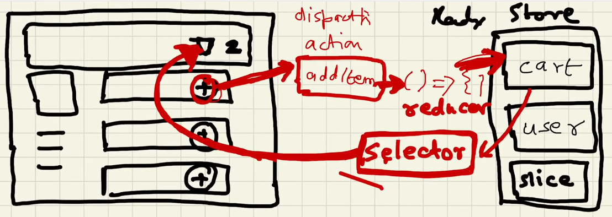
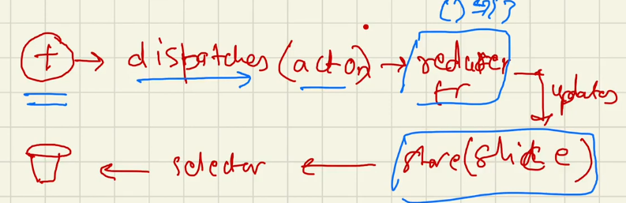

# Jo Dikhta hai Vo Bikta hai
# Q: Why we Use Frameworks
  A: 1. to Write optimized css, 2. it saves time
 
- Why frameworks?

  - optimized css,
  - consistent UI
  - saves time.
  - Eg : MaterialUI, Bootstrap, Base Web UI, Ant design, chakra UI

- Can we use more than one framework ?

  - It's all package can use any number of frameworks,
  - But, not consistent way

- Different ways to write css :

  1. **Normal Native CSS** - all components's styles in a single file index.css
  2. **SCSS** - Syntactical CSS - atlast it is converted to css
  3. **Inline CSS** - style attribute - pass object - {{backgroundColor : "red"}}
  4. **Component Library** - MaterialUI, Bootstrap, Base Web UI, Ant design, chakra UI
  5. **CSS Framework** - Tailwind
  6. **Styled Components**: Majorly used in react projects.

- **Important**: In a `system design round of interview`, you always have to discuss that

  - what will you use for styling your components?
  - Now, there are differnet ways, you can style your web apps.
  - But, what way you will choose & you have give a a good reason for it.
  - So, you should know what are the pros & cons of using them.
  - Exapmle: what are pros & cons of using `Native CSS` over `SCSS` or `component library`

- Pros & Cons of using Component librery (i.e MaterialUI, Bootstrap, etc)

  - Pros :

    - `consistent UI`: (All the button in your app will look the same now)
    - save time

  - Cons :
    - Bundle size -
    - Loose control over design
    - personal customizition is hard

### Tailwind CSS:

- When? How? & Why? to use it.

- writing css on the go (i.e in the same file )
- reusablity
- less bundle size (minimal css) only includes the css classes that we have used
- Flexible UI (Customizable)

  PROS: Easy to use, More Reuseablitit, code is less, no duplicate css, fast time, easy to debug
  CONS: Heavy Bundle Size

It's comes with some predefined configuration and same need to configure in project. Different Framework or library have it's own configuration like parcels and Angular comes with difference configuration. For Detailed knowladge follow the tailwind documentation.

how to put Tailwind
using cdn links in index.js file


Install Tailwindcss Using Parcel
npm install -D tailwindcss postcss
npx tailwindcss init >> it make tailwind.config.js

In the tailwind.config.js file "content" array is use so that tailwind know that only these extension file be executed

# postcssrc we have to create so that our bundler know that we use tailwind css so it can compile
In short 'it compile Tailwind Css into normal css'

when we write tailwind css we dont write any css in css file just write
@tailwind base;
@tailwind components;
@tailwind utilities;


use extension tailwindcss intellisense

use [] =>Square bracet notesion for the precious or exact value or dynamic value
example: w-[200px]

# -----------------------------------------------------------------------------------

# Data is the New Oil

UI Layer < Data Layer (UI Layer | Data Layer)

# Q: In UI what does data layer consist of ?
  A:It Manges by State and props

#   Q: Diffrence Between State And Props ?
    A: State can be change where Props cannot be change
        State which in the local variable 
        Props are somethings whoes value can be pass from one element component to the another
        Props are kind of local state variable to the parent component
        # Props is something which is recieving inside the component

# PROPS DRILLING => drilling props from top to bottom level

React dev tools extension in chrome
showing whole tree in chrome


accessing parents property into child is called PROPS Drilling
and we can access child property by using custom hooks 

# useContext is the normal hook
# React context is use for piece of data use anywhere in the app and it is normal function
u can create multiple context in the app

Props And state are tied to the compoent but React Context is not tied to the component

<UserContext.Consumer>
<UserContext.Provider>

# React routing also  done with the help of context

#only for debugging
Writing a name to the context provider is good and remove the comfusion if had more context in the app so use
put the .displayName method
ex: userConetxt.displayName = "Name_Which_want_to_display";


# We use Contex to avoid Prop Drilling
Asume Contex like a outer garage where u store cars  and can be use 
# Any component of ur app can be access and can be modify the context
ex : theme (dark and light)
# -----------------------------------------------------------------------------------
    # Lets Build our Store  
  
# Redux
  It help to manage Data Layer of our Application
  It burden to use context for the large scalable app so Redux come into the picture


When u use to build small app then context u have to use otherwise redux

# It is complicated library so it come with REDUX TOOLKIT


## Theory:

<!-- *******************************-->
<details>
<summary>useContext vs Redux.</summary><br>
<blockquote>

Both **useContext** and **Redux** are used to solve `props drilling`, a problem faced while passing props between components. 

   | Context API | Redux  | 
   | :----    | :------ | 
   |`Context` provides a way to share values between components (throughout the application) without having to explicitly pass a prop through every level of the tree.    | Redux is a central store for storing the data of the applications. | 
   | Context API is `built-in React tool` and does not have to be downloaded separately  | Redux is an `third-party` open source library `not part of React` which provides a central `store`, and actions to modify the store.  | 
   | Requires minimal Setup | Requires extensive setup to integrate it with a React Application  | 
   | Specifically designed for static data, that is not often refreshed or updated | Usefule for both static and dynamic data | 
   | Difficult to debug | Easy to debug using Redux dev tool |
   | Useful for small projects | Useful for larger projects |
</blockquote><br>
</details>

<!-- *******************************-->
<details>
<summary>Advantage of using Redux Toolkit over Redux.</summary><br>
<blockquote>

1. `Abstraction and Convenience:` Redux Toolkit provides a set of abstractions and conveniences on top of regular Redux, which make it easier to work with and manage the state of your application. This includes features such as the `createSlice` function for creating slices of state and its associated `actions and reducer`, and the `createStore` function for creating a `Redux store` with pre-configured middleware and enhancers.

2. `Immutable updates:` Regular Redux requires you to create a `new state object` every time you make an update, which can become repetitive and error-prone. Redux Toolkit provides a way to `update the state immutably`, using its built-in `createSlice` function.

3. `Simplified Reducers:` In regular Redux, you write your `own reducers`, which can become complex and difficult to manage as your application grows. With Redux Toolkit, you can use the `createSlice` function to generate reducers for you, based on the state updates you define.

4. `Improved Performance:` Redux Toolkit uses advanced performance optimizations, such as memoization, lazy evaluation, and selective updates, to make your application faster and more efficient.

5. `Better Debugging:` Redux Toolkit provides better debugging tools, such as the ability to log and replay actions, inspect the current state of your application, and easily track the changes made to your state over time.
</blockquote><br>
</details>

<!-- *******************************-->
<details>
<summary>Explain Dispatcher.</summary><br>
<blockquote>

A dispatcher is a `function` that dispatches actions to the store.  In Redux, actions are used to describe changes to the state, and dispatching an action is the way to trigger those changes.

   - How to create & use dispatcher function ? 

   ```
   const dispatch = useDispatch();
   ```

   This hook returns a reference to the `dispatch function` from the `Redux` store. You may use it to dispatch actions as needed.

   ```
   dispatch(actionCreator(data)); // returns an action payload object 
   ``` 

   When you dispatch an action creator, it returns an `action object` that the `reducer function` uses to update the `state`. The dispatcher function is used to dispatch the action creator and which in turns calls the reducer function to trigger the update.
</blockquote><br>
</details>

<!-- *******************************-->
<details>
<summary>Explain Reducer.</summary><br>
<blockquote>

A reducer is a `pure function` in Redux that takes the `current state` of your application and an `action`, and returns a `new state` based on that `action`.

Example : 
   ```javascript
   addItem: (state, action) => {
      const item = state.items[action.payload.id];
      const quantity = item && item.hasOwnProperty('quantity')
        ? state.items[action.payload.id]?.quantity + 1 : 1;
      state.items[action.payload.id] = { ...action.payload, quantity };
      state.totalItemsCount = state.totalItemsCount + 1;
   },
   ```

   Here based on the action object, the state is updated inside teh reducer function.
</blockquote><br>
</details>

<!-- *******************************-->
<details>
<summary>Explain slice.</summary><br>
<blockquote>

In Redux Toolkit, a `slice` is a piece of the state that is managed by a single set of actions and reducer.
</blockquote><br>
</details>

<!-- *******************************-->
<details>
<summary>Explain selector.</summary><br>
<blockquote>

- A `selector` is a pure `function` that takes the current `state` of your application and returns a derived value based on that state. 

- `useSelector` is a hook from the `react-redux` library that allows you to `subscribe` to the `state` of your Redux store from a React component.  
- The `useSelector` hook takes a `selector function` as its argument, which is used to extract data from the state tree. 
- The component will re-render whenever the state of your Redux store changes and the derived value returned by the selector function changes.

```javascript
const totalItemsCount = useSelector(store => store.cart.totalItemsCount);
```

`store => store.cart.totalItemsCount` is the selector function which *returns* the `totalItemsCount` from the *state*. 
Now, useSelector() is used to subscribe to this totalItemsCount from the state.
</blockquote><br>
</details>

<!-- *******************************-->
<details>
<summary>Explain createSlice and the configuration it takes.</summary><br>
<blockquote>

The `createSlice` function is used to create a store slice, a piece of the store.

The  `createSlice` function takes an `object` as an argument, which contains the following properties:

- `name:` A string that represents the name of the slice.
- `initialState:` An `object` that represents the `initial state` of the slice. In our cartSlice example, the initial state is an object with two properties: `items` (an empty object) and `totalItemsCount` (which is 0).
- `reducers:` An `object` that contains the Redux reducers for the slice. Reducers are functions that take the current `state` and an `action`, and return a new state based on the action type and payload. In our example, there are three reducers: addItem, removeItem, and clearCart.

After creating the slice, the code `exports` the `actions` that can be dispatched on the store. In this example, there are three actions: addItem, removeItem, and clearCart.

Finally, the code `exports` the `reducer` for the slice using the reducer property of the slice. The reducer is responsible for managing the state of the slice and updating it in response to dispatched actions.
</blockquote><br>
</details>
<!-- *******************************-->

redux store is nothing but the big Object which has small section

@Dispatch
@Slicer
@Reducer
@Selector   `Subscribing`

if u click on the + button of the store it will dispatches an action which calls reducer function which update slice of redux store

+ Button  >>Dispatching Action >> Reducer function >> Slice redux store >> Selector

When we click on Add Button, we dispatch an action, which calls a reducer function, which updates the slice of the store & for reading data, we subscribe the store. Then, it automagically updates.


<p></p>


Selector is Hook


npm i @reduxjs/toolkit  >> to install the Redux Library >> It is the core of redux
npm i react-redux  >> it is bridge between react and redux


configureStore()

provider help to connect the store with app
createSlice


  createSlice
        name
        initialState
        reducers
            addItem
            clearCart
Reducer contain Mapping of action and reducer function 

# useSelector hook is very good hook it will directly give access to the store  It is help to SUBSCRIBE
Subscribing to the specific store

useDispacth come from react-redux

# Redux === context

Redux devtool Extension  IMP if u work in redux

# -----------------------------------------------------------------------------------
    ## Time for test

How to test ur react application

# React Testing Library

# Q: Why we need Test Cases ?
  A: To check the performace of code
     1.Adding new functionality will not break existing functionality

@ Test Driven Development

# JEST = Javascript Testing Framework 
# jest find the test cases writtin in the file


Install Testing Library
    npm i --save-dev @testing-library/react
    npm i -D jest
    configure jest by creating jest.config file
            -> npx jest --init
    npm run jest
    npm i -D jest-environment-jsdom
Create my first test
    - create ne folder with the name "__tests__"
    naming convention for writing the test cases with ".test.js"
Configure jest with babel
    -> npm install --save-dev babel-jest @babel/core @babel/preset-env    
     -[JEST Configure doc] (https://jestjs.io/docs/getting-started#using-babel)
Write some text cases
then npm run test
-gitignore Coverage report


.babelrc    >>  require JSON data not JS file data

we r not running testcases into the browser we write test case to run on jsdom
JSDOM is the mini Browser(some functionality)

render use in the .test.js file help to load perticual portion and we write just like we like for the whole app
this library comes form the @testing-library/react


Install npm i -D @babel/preset-react
JEST does not understand jsx so to understand write 
["@babel/preset-react",{"runtime" : "automatic"}] in babelrc file it help JEST to read JSX

jest doesnot able to read png file so in jest config file moduleNameMapper will help

staticRouter comes from reacr-router-dom/server


data-testid
@getAllByTestId

fetch is not understand by the jest use 
global.fetch = jest.fn() 

expect().toBe
# watch-test : "jest --watch"  Help not to write again an again like HMR

Install 
npm i -D @testing-library/jest-dom

# -----------------------------------------------------------------------------------

    # MAchine Code Interview

    1. Requirement clearificaition
        -> Features
        -> Tech Stack
            -> Redux or Contex
            -> TaiwindCSS
            -> react router dom
            -> bundler
            -> JEST

# npx create-react-app
 
 npx tailwind init create tailwind config file

 # racfe

